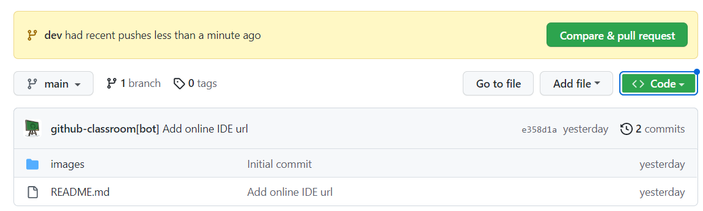

# Clone and sort
Here you will learn to clone an object and sort numbers from an input

## Steps

- Clone this repo:
    - click the green Code button in github, copy the URL
    - open the Visual Studio Code in your learning folder and and write in terminal `git clone <paste_your_url_here>`
- create a separate branch `git switch -c "dev"`
- add html and css files and code
- in VS Code, click on html file and Go Live (plugin installed previously) to avoid refreshing the page on changes
- when you're done coding, add the changes to staging using + button in VS Code Source Control tab or type on terminal `git add .`
 
- commit and push the code `git commit -am "commit message here"`, `git push -u origin dev`
- go to github and raise a pull request from your development branch to master
 

## Requirements
## Exercise 1:
- create an empty html file (no elements in body) which runs a javascript file.
- define this object in the js file:
```
var deepObject = { prop1: 1, prop2: '2', prop3: false, prop4: { prop5: [5, 6, { id: 7, other: [8, 9]}] }, prop6: [6, 7, 8, 9, 10] }
```
1. deep clone the deepObject above using a javascript library or existing javascript functions (the object needs to be deep cloned - object params or children object params need to be cloned as well)

2. deep clone the deepObject above by manually iterating thought object params or children object params and apply cloning wherever necessary (using loop functions and/or recursive functions)

3. prove that the object and its child objects have been succesfully cloned (show that the object or the child objects have not been passed by reference in the new cloned object and/or show that changing some parameters in any of the cloned objects does not trigger changes in the initial deepObject or the other cloned object)​

## Exercise 2:
- create an html page where you add an input text field, an empty text paragraph below the input and a button called 'Sort' below the paragraph
- when opening the page, after entering some numbers in the input field separated with either `,` or `space` character and clicking the Sort button, the empty paragraph should be populated with numbers sorted in asceding order (example: entering `5,3,4,1,2` in the input field should output `1, 2, 3, 4, 5` in the empty paragraph) also, if characters other than numbers or `,` and `space` character have been entered in the input field, display an alert in the browser saying that invalid numbers have been supplied.

Other requirements:
- if you need to upload images to your repo, place them all inside the images folder
- use English everywhere (page, variables naming, comments, commit messages)
